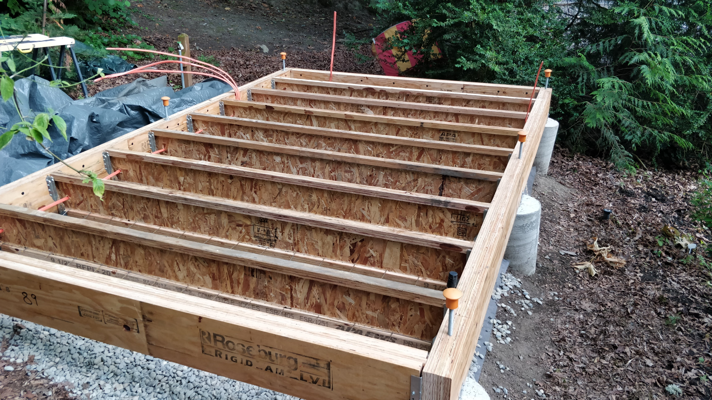
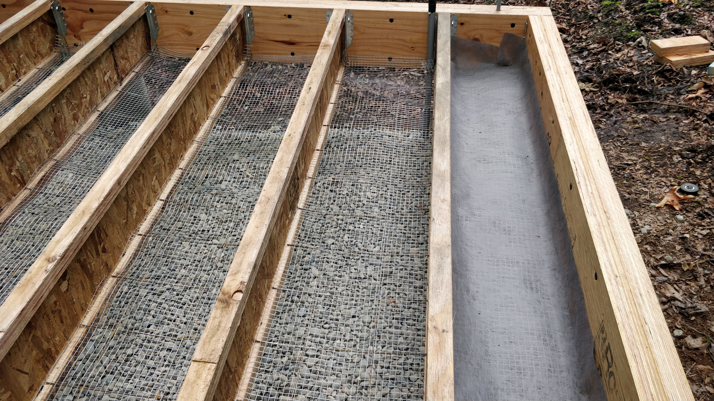

It was surprisingly fast getting the I-joists in place. 
I also ran wires from each wall to where a small exterior electrical panel will go so I don't need to route wires around corners.
(All wires are 10-3 just in case and because I can.)

In order to keep all manner of critters from getting into the insulation, I installed some (shockingly cheap) rebar mesh in between the joists...

...followed by some hardware cloth and finally some landscaping fabric:

The insulation went in like butter:

Then I glued and screwed down 3/4" tongue-and-groove OSB, used an edge-trim bit on the router to clean off any minor overhangs on the edges (since I didn't quite get the tongues and grooves to fit so it got a touch weird) and called it a day.

### Lessons learned
* I'd spent days thinking about how I was going to attach the rebar mesh and all that stuff - relying on a simple friction fit turned out to be a perfectly fine solution. It squishes the insulation by the height of the bottom I-joist flange, but whatever. Simple is better, most of the time.
* A well-sharpened machete (I think we keep one around for emergency situations?) is a fantastic tool for cutting roll insulation.
