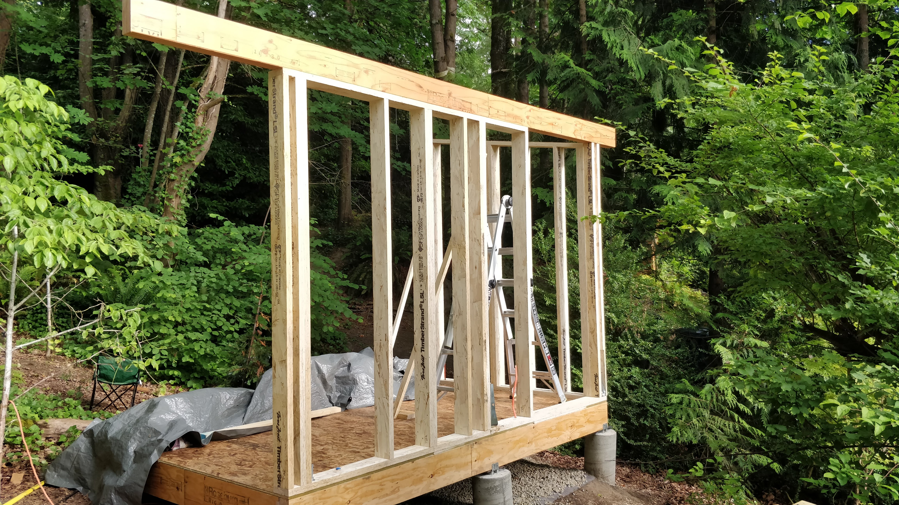
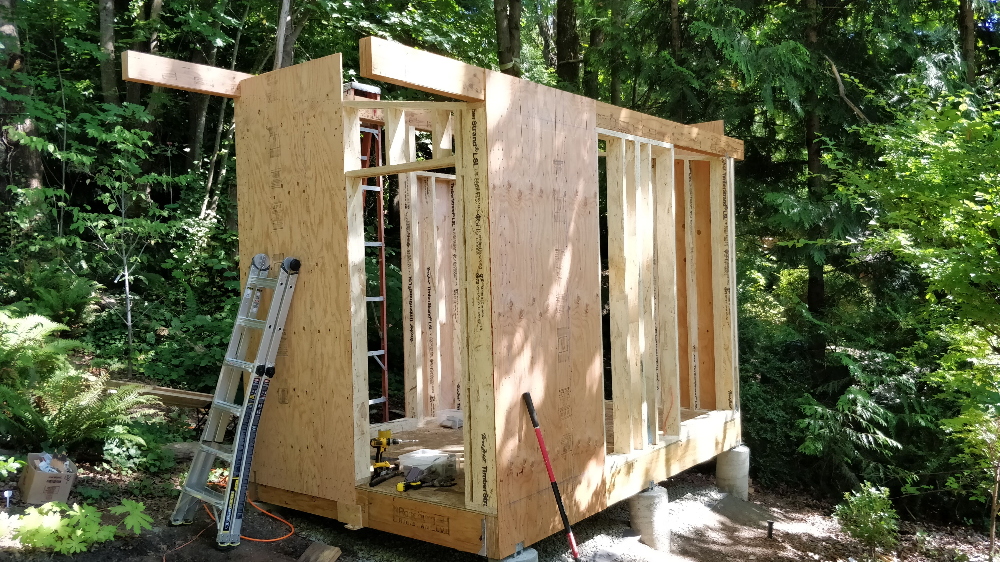
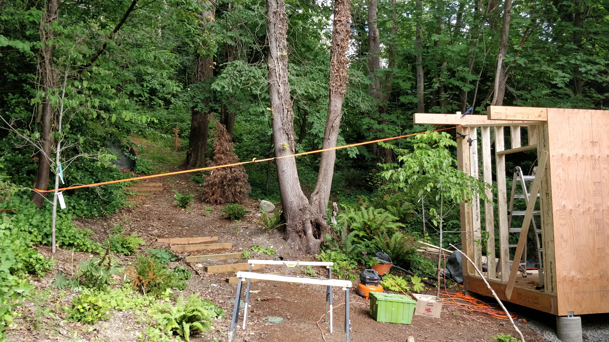

The wall framing is surprisingly cooky because of the nature of the floor-to-ceiling windows. Wherever there's a window, the rough opening goes all the way to the underside of the roof system so there is no top plate and the roof system needs to hang off a beam rather than sitting on top of one.

I made the somewhat special choice to continue doing all the work by myself, so putting up walls by myself took a while.

I framed each wall on the ground, mounted stops at the perimeter of the floor framing to keep them from falling off while standing them up, and then heaved them up onto progressively higher blocks (milk crates, chiefly) before executing a final push up.

While I had already trimmed the 5/8" threaded rods to about the right height, they presented a major pain when standing up the walls for the long sides. I stood up the first long wall onto some blocks to get it on top of the threaded rod, carefully navigated the wall into place using my 4lb fine adjustment hammer, and then removed the blocks.

I should have been more careful the first time 'round about nailing off a diagonal support for the wall since I managed to tip it over and off the edge of the structure; it took a while to haul it back into place from a position of considerable disadvantage with it hanging off the side of the damn thing. I was a lot more careful with the second long wall (which, due to all of its windows and resulting lack of top plate came together in two separate, easier to manage sections).

After I had two walls in place, I put up the lower roof beam (two 7-1/4" x 1-3/4" LVLs), partially just out of spite.

I then put up the remaining walls, plumbed and installed the first piece of sheathing for each wall to start getting things more solid, and got the second roof beam in place.

The threaded rod attaches to double studs via an HDU5 holddown for glorious shear walls.

And since the floor-to-ceiling windows are also corner-to-ceiling windows (i.e. the interior side trim of the window is just the drywall continuing on from the adjacent wall), the holddowns for those needed to be a bit special (HTT5).

I plumbed every wall with the most accurate of tools, a simple gravity-bound plumb bob. This one I happened to have turned myself in machine shop back in college.

Since I was solo-plumbing my solo-built walls, I relied on ratchet straps to surrounding trees to encourage the framing to reach plumb before I nailed off the sheathing.

At this point it had become obvious that the new tree near the cottage's front door (planted after the actual house was built) was going to be in the way so we ended up moving the tree before I could finish up all the sheathing. We tried to dig a pit for the tree nearby but ended up pick-axing into two of the pipes for the irrigation system so that project grew needlessly complex. The tree now lives on another side of the property and we'll see if it makes it.

### Lessons learned
* Don't be dumb - get people to help you.
* Always nail off safeties - never skimp.
* Engineered framing lumber is magical for its straightness but seemingly twice the weight of solid sawn 2x6s. This tradeoff is cumbersome when standing up walls by oneself, to say the least.
* I splurged on 4'x10' plywood for the sheathing and it saved me from managing any seams. I'm slowly getting better at trading time (and joy) for material costs. 
* Seams between side-by-side sheets of plywood get double studs so I don't need to precisely manage nails from two sheets into a single studs. Also well worth it.
* PVC repair fittings are pretty cool and seem to be holding up so far; both small and large hardware stores seem to carry them (figures).
* Somehow everything ends up being more time-consuming than one had imagined. Ugh.